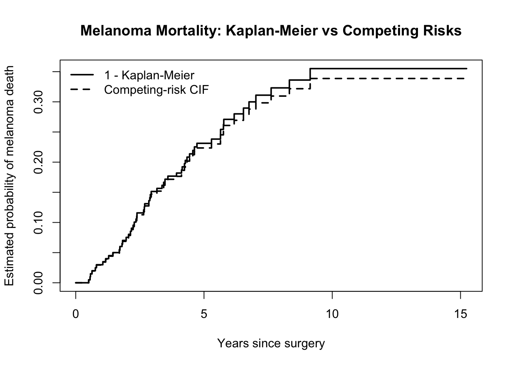
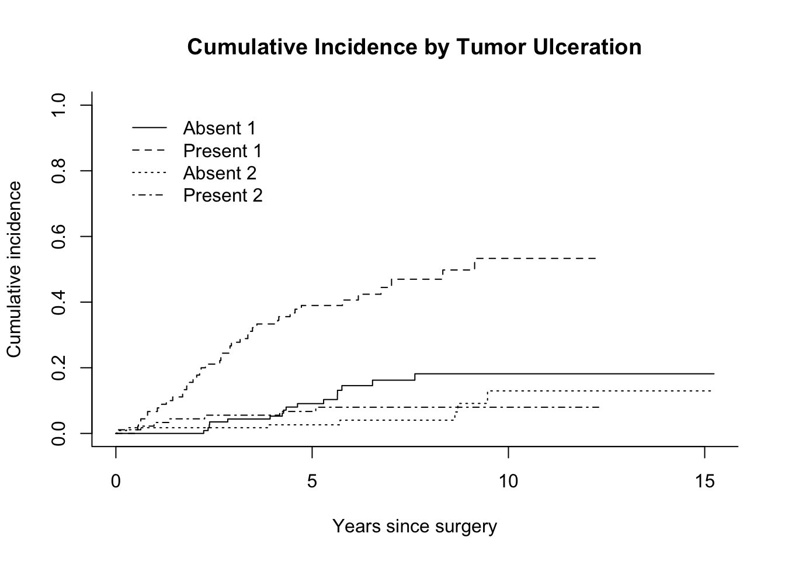

# Melanoma-Specific Mortality Under Competing Risks

A reproducible survival-analysis case study examining melanoma-specific mortality in a historical Danish melanoma cohort using **cause-specific Cox regression, time-varying effects, cumulative incidence, and Fine–Gray competing-risk regression in R**.

The analysis focuses not only on fitting survival models, but on a central statistical question:

> **How does the interpretation change when the estimand shifts from the rate of melanoma death among patients still at risk to the absolute probability of melanoma death in the presence of competing mortality?**

## Research Questions

1. How are patient age, sex, tumor thickness, and tumor ulceration associated with melanoma-specific mortality?
2. How does explicitly accounting for death from other causes affect inference about melanoma mortality?

## Data

The analysis uses the `melanoma` dataset distributed with the R `boot` package.

The cohort contains **205 patients**:

| Outcome           |   n |    % |
| ----------------- | --: | ---: |
| Melanoma death    |  57 | 27.8 |
| Alive / censored  | 134 | 65.4 |
| Other-cause death |  14 |  6.8 |

Other-cause mortality is treated as a competing event because a patient who dies from another cause can no longer subsequently experience melanoma death.

## Statistical Approach

The analysis was developed sequentially around the statistical estimand rather than by applying multiple models indiscriminately.

**Cause-specific mortality**

* Multivariable Cox proportional-hazards regression
* Schoenfeld-residual diagnostics
* Penalized splines to assess continuous-variable functional form
* Time-varying coefficient for tumor thickness after evidence of non-proportional hazards

**Absolute melanoma mortality under competing risks**

* Naive (1-KM) melanoma-mortality estimates
* Cumulative incidence functions
* Fine–Gray proportional subdistribution-hazards regression
* Gray's test for cumulative-incidence differences by tumor ulceration

## Key Findings

### Tumor thickness showed a time-dependent association

The initial cause-specific Cox model estimated a higher melanoma-death hazard with increasing tumor thickness. Schoenfeld residuals indicated non-proportional hazards for thickness ((p=0.031)).

After allowing the thickness coefficient to vary with log follow-up time, the estimated hazard ratio per additional millimeter was approximately:

| Follow-up | HR per +1 mm |
| --------- | -----------: |
| 1 year    |         1.20 |
| 3 years   |         1.07 |
| 5 years   |         1.02 |
| 8 years   |         0.97 |

The time interaction was supported by the data (`HR = 0.902`, 95% CI `0.818–0.994`), suggesting that tumor thickness was most prognostic during early follow-up and that its relative association attenuated with time.

The late-follow-up estimate should not be interpreted as evidence that greater thickness becomes protective; fewer and increasingly selected patients remain at risk during later follow-up.

### Competing mortality modestly affected absolute melanoma risk

Treating other-cause deaths as ordinary censoring consistently produced slightly higher melanoma-mortality estimates than the competing-risk cumulative incidence function.

| Follow-up | 1 − Kaplan–Meier | Competing-risk CIF | Difference |
| --------- | ---------------: | -----------------: | ---------: |
| 1 year    |            2.99% |              2.94% |    0.05 pp |
| 3 years   |           15.14% |             14.71% |    0.43 pp |
| 5 years   |           23.13% |             22.35% |    0.77 pp |
| 8 years   |           32.32% |             30.96% |    1.35 pp |

The difference increased over follow-up but remained modest because competing deaths were relatively uncommon in this cohort.

### Tumor ulceration was the strongest prognostic characteristic

In adjusted Fine–Gray regression:

* **Ulceration:** SHR = **3.09** (95% CI 1.71–5.60)
* **Tumor thickness:** SHR = **1.09 per mm** (95% CI 1.01–1.18)
* **Male sex:** SHR = 1.50 (95% CI 0.87–2.57)
* **Age:** SHR = 1.01 per year (95% CI 0.99–1.02)

The broad conclusions were similar under the cause-specific Cox and Fine–Gray frameworks, despite the models targeting different statistical quantities.

### Absolute melanoma mortality differed substantially by ulceration status

At five years, melanoma cumulative incidence was approximately:

* **39.0%** among patients with ulcerated tumors
* **9.1%** among patients without ulceration

At ten years, the corresponding estimates were approximately **53.3%** and **18.2%**.

Gray's test provided strong evidence that melanoma cumulative-incidence functions differed by ulceration status ((p = 3.2\times10^{-7})).

## Interpretation

The project illustrates why survival-model selection should follow the **scientific estimand**.

A cause-specific Cox model answers:

> Among patients who remain event-free, how are covariates associated with the instantaneous rate of melanoma death?

A cumulative-incidence or Fine–Gray analysis instead addresses:

> In the observed population, where another cause of death can prevent melanoma death, how are covariates related to melanoma mortality over time?

In this cohort, accounting for competing mortality changed absolute melanoma-risk estimates only modestly, but doing so remains important because the two approaches answer fundamentally different questions.

## Repository Contents

| File                            | Purpose                                                                                |
| ------------------------------- | -------------------------------------------------------------------------------------- |
| `melanoma_competing_risks.Rmd`  | Complete reproducible analysis, statistical reasoning, diagnostics, and interpretation |
| `melanoma_competing_risks.html` | Rendered analysis report                                                               |
| `figures/`                      | Model diagnostics and main results figures                                             |

## R Packages

The analysis primarily uses:

`survival` · `cmprsk` · `boot` · `dplyr` · `ggplot2`

## Reproducibility

The dataset is loaded directly from an R package rather than stored as a separate copy in this repository. The complete analysis pipeline, from outcome recoding through model diagnostics and competing-risk regression, is contained in the R Markdown file.

---

**Kashyap Ava**
M.S. Statistics, University of Illinois Urbana-Champaign

